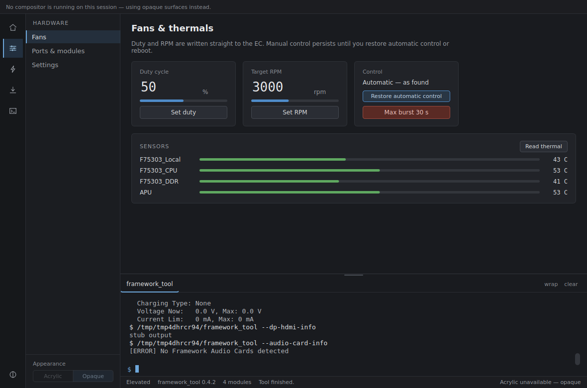
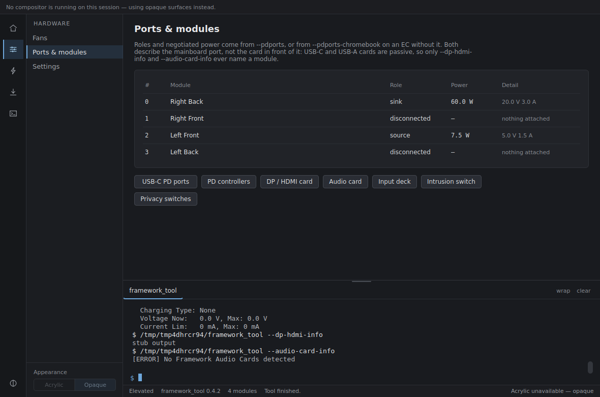
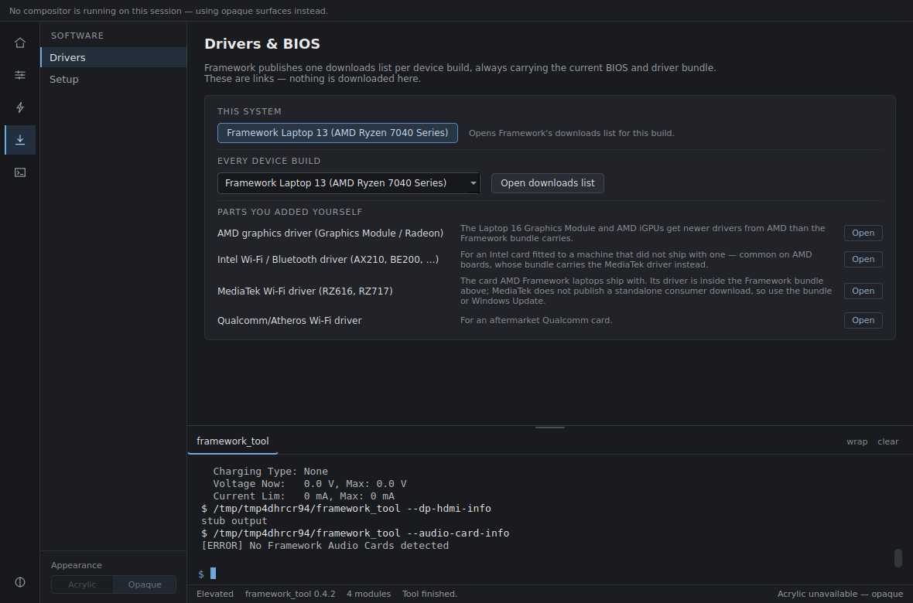
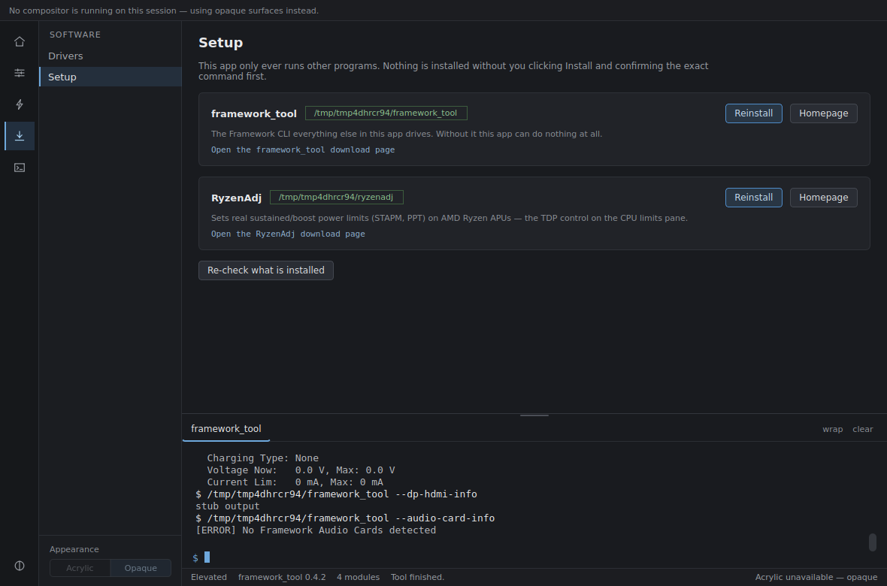
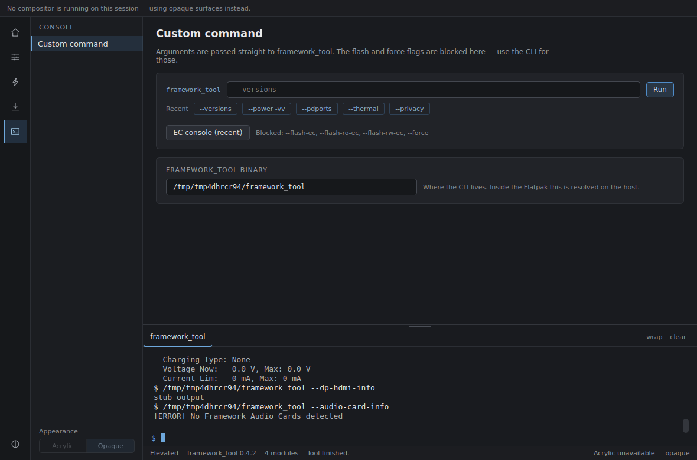

# Framework-Tool-GUI

[](https://github.com/Tri-Lumen/Framework-Tool-GUI/actions/workflows/ci.yml)

A desktop front-end for
[framework_tool](https://github.com/FrameworkComputer/framework-system), the
official CLI for Framework laptop and desktop firmware — fans, battery charge
limits, keyboard backlight, USB-C PD ports, diagnostics — plus CPU power
limits, driver downloads, and a setup section for the helper tools those
need. Windows and Linux.

`framework_tool` itself must be installed on the machine
(Windows: `winget install framework_tool --source winget`; Linux: your
distro's `framework-system` package). This app shells out to that CLI and
shows you every command it runs and what came back — it has no other way to
talk to the hardware, and it never touches it directly.

## Download

| Platform | Download | What you get |
| --- | --- | --- |
| **Windows** (recommended) | [FrameworkGUI-Setup.exe](https://github.com/Tri-Lumen/Framework-Tool-GUI/releases/latest/download/FrameworkGUI-Setup.exe) | Installer — Start Menu entry, uninstaller, Apps & features entry |
| **Windows** (portable) | [FrameworkGUI.exe](https://github.com/Tri-Lumen/Framework-Tool-GUI/releases/latest/download/FrameworkGUI.exe) | Single self-contained exe, nothing installed |
| **Linux** | [FrameworkGUI.flatpak](https://github.com/Tri-Lumen/Framework-Tool-GUI/releases/latest/download/FrameworkGUI.flatpak) | Flatpak bundle — `flatpak install --user FrameworkGUI.flatpak` |

These links always resolve to the newest
[release](https://github.com/Tri-Lumen/Framework-Tool-GUI/releases).

**Windows.** Run the installer. It adds a *Framework System GUI* Start Menu
group containing the app and an Uninstall entry, and registers in Settings →
Apps. The app self-elevates — one UAC prompt per launch, no console window.
SmartScreen will warn about the unsigned installer ("More info" → "Run
anyway"); there is no code-signing certificate for this project.

**Linux.**

```bash
flatpak install --user FrameworkGUI.flatpak
flatpak uninstall --user io.github.frameworkgui.FrameworkGUI
```

The sandbox cannot reach the embedded controller, so the app runs the host's
`framework_tool` through `flatpak-spawn --host`. Install `framework_tool` on
the host, not in the sandbox.

Full instructions, including running from source, are in
[Installation](wiki/Installation.md).

## What it does

**Firmware, through framework_tool.** Fan duty and RPM with automatic control
one click away; charge limits and the rest of the EC settings, each read back
with the reader that suits it; USB-C port state; twelve diagnostic workflows
that run a sequence of commands and restore whatever they changed, including
on cancel. Only the controls your board actually supports are shown — and if
detection fails, everything is shown rather than guessing.

**CPU power limits**, which the EC does not own. The app picks a backend from
your CPU and OS:

| Backend | CPU | OS | Sets |
| --- | --- | --- | --- |
| [RyzenAdj](https://github.com/FlyGoat/RyzenAdj) | AMD | Windows, Linux | STAPM / PPT fast / PPT slow — real watts |
| Linux powercap (RAPL) | Intel, some AMD | Linux | Kernel long/short power limits — real watts |
| `powercfg` | any | Windows | Max processor state % — a frequency cap, not a wattage |

RyzenAdj and RAPL limits are **volatile**: a reboot clears them, and sleep or
an AC/battery transition often does too. Making them stick needs something
running in the background, which this app deliberately does not have — so the
pane links the documentation for setting that up yourself with the tool it
actually used. `powercfg` is the exception; Windows saves it with the power
scheme.

**Setup** detects the helper tools and installs them, always showing the exact
command first and waiting for you to confirm. **Drivers** opens Framework's
downloads page for your exact device build, plus vendor pages for parts the
bundle does not cover.

**No background processes.** No services, timers, tray icons or autostart
entries. A process is spawned when you press a button and exits when the
command finishes. That is also why power limits do not survive a reboot.

## Screenshots

Every capture is the app driven against a **simulated** `framework_tool` — no
Framework hardware was involved, and the device details are stand-ins.

| Overview | Diagnostics |
| --- | --- |
| [](wiki/screenshots/overview.png) | [](wiki/screenshots/tools.png) |
| Detected board, live stat cards, and the expansion bays. | The twelve workflows, each with the timings you can override. |

| Fans | Ports & modules |
| --- | --- |
| [](wiki/screenshots/fans.png) | [](wiki/screenshots/ports.png) |
| Duty and RPM control, with automatic control one click away. | Per-port role and power, plus the card queries. |

| Settings | CPU limits |
| --- | --- |
| [](wiki/screenshots/settings.png) | [](wiki/screenshots/power.png) |
| Charge presets sit above the rows they write; Auto where the CLI has one. | Real STAPM/PPT limits through RyzenAdj, with the volatility spelled out. |

| Drivers | Setup |
| --- | --- |
| [](wiki/screenshots/drivers.png) | [](wiki/screenshots/setup.png) |
| Framework's downloads page for this exact build, plus vendor drivers. | Detects the helper tools and shows the exact install command first. |

| Console |
| --- |
| [](wiki/screenshots/console.png) |
| Free-form arguments, with the hardware-bricking flags refused. |

### The same app on different devices

Detection is what decides which controls exist. A Laptop 12 gets the stylus,
touchscreen and tablet-mode rows; a Laptop 16 loses those and gains its
expansion bay and a six-slot chassis; a Desktop loses everything
battery-shaped and keeps only the RGB row.

| Laptop 12 | Laptop 16 (Graphics Module) | Desktop |
| --- | --- | --- |
| [](wiki/screenshots/device-laptop-12.png) | [](wiki/screenshots/device-laptop-16.png) | [](wiki/screenshots/device-desktop.png) |
| 4 bays, stylus + touchscreen detected | 6 bays, longer chassis, bay reports the GPU | 2 front bays, no battery readings |

## Documentation

The [wiki](https://github.com/Tri-Lumen/Framework-Tool-GUI/wiki) covers
installation, each section of the app, per-device support, and
troubleshooting. Its pages live in [`wiki/`](wiki/) in this repository so
they are reviewed alongside the code they describe.

- [Installation](wiki/Installation.md) — including installing `framework_tool` itself
- [Using the app](wiki/Using-the-app.md) — the nine sections, one at a time
- [Device support](wiki/Device-support.md) — which controls each board gets, and why
- [Troubleshooting](wiki/Troubleshooting.md) — blank readings, idle bays, permission prompts
- [Architecture](wiki/Architecture.md) and [Development](wiki/Development.md) — for anyone changing it

## License

[MIT](LICENSE) — fork it, reuse it, ship it, no permission needed. This is
an unofficial project and is not affiliated with or endorsed by Framework
Computer Inc.
