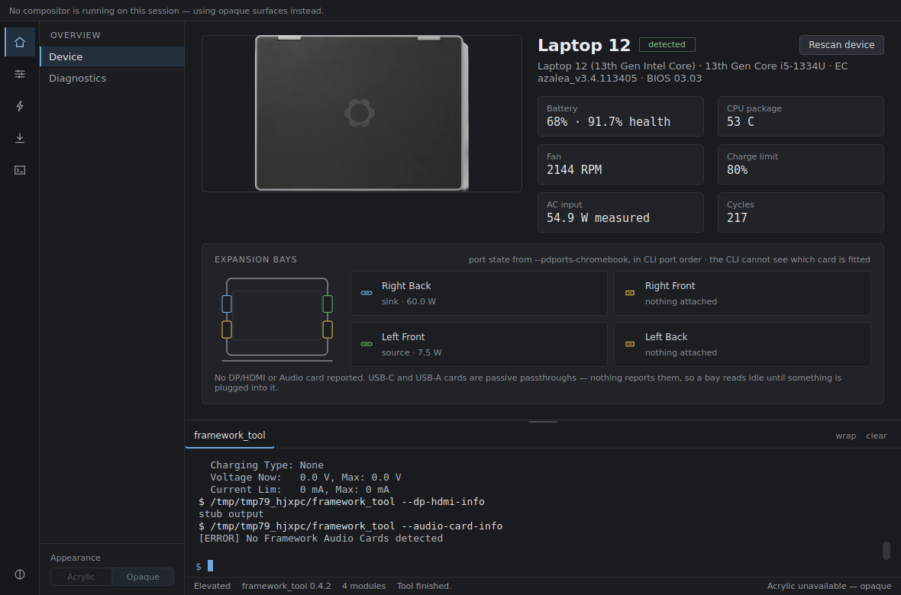
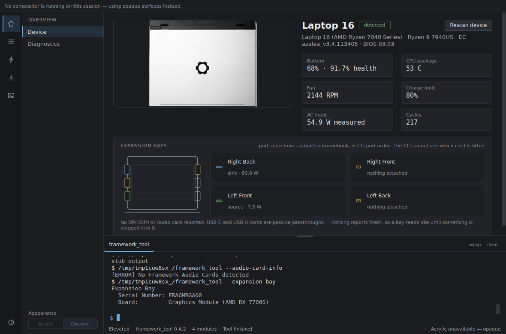
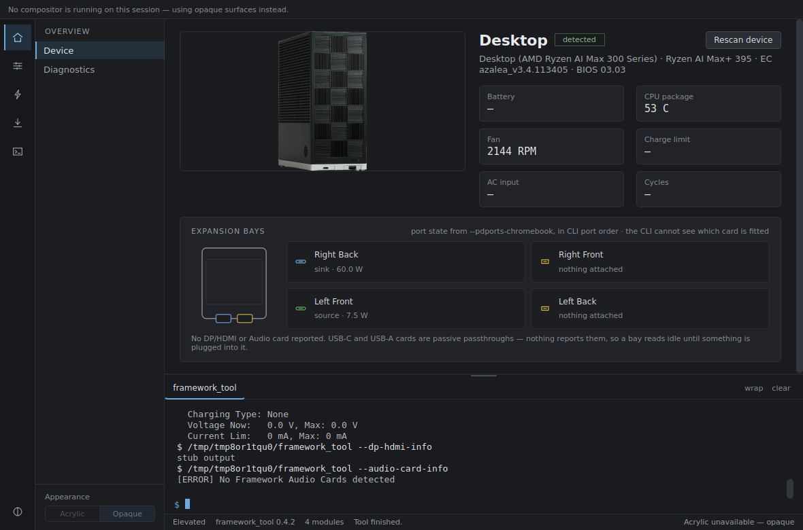

# Device support

## Detection is fail-open

The launch scan runs `--versions` and turns it into a capability set. **Any
field it cannot confidently determine defaults to "show the control."** A
control that does not apply to your device is a minor annoyance; a control
that is hidden when it should have been there is worse. If detection fails
outright you get everything.

## What each board gets

| Board | Gains | Loses |
| --- | --- | --- |
| Laptop 12 | Stylus, touchscreen, tablet-mode override | — |
| Laptop 13 | Touchscreen *only if* `--versions` shows a Touchscreen section | Stylus, tablet mode |
| Laptop 16 | Expansion bay | Stylus, touchscreen, tablet mode |
| Desktop | RGB LED control | Battery, charge limit, keyboard backlight, fingerprint LED, tablet mode, touchscreen, stylus, input deck, expansion bay, privacy switches |

Touchscreen and stylus are gated on **content detection** — does `--versions`
actually report that section — not on the model number, so a Laptop 13 with
the touchscreen bezel and one without get different UIs. Expansion bay and
RGB are gated on the model number, following the CLI's own documented
restrictions.

## Chassis drawing

The bay diagram is scaled from each chassis's published dimensions and drawn
with the number of expansion slots that machine actually has — four on a
Laptop 12 or 13, six on a Laptop 16, two front slots on the Desktop, which is
drawn as the cube it is.

Note that the slot count is not the PD port count: every platform reports at
most four USB-C PD ports, so on a Laptop 16 two of the six drawn slots will
have no port data behind them.

## Device photographs

One per *chassis*, not per mainboard — swapping the mainboard does not change
what the machine looks like. Two things do and get their own image: the
Laptop 13 Pro's black lid, and a Laptop 16 with a Graphics Module fitted
(detected from `--expansion-bay`).
