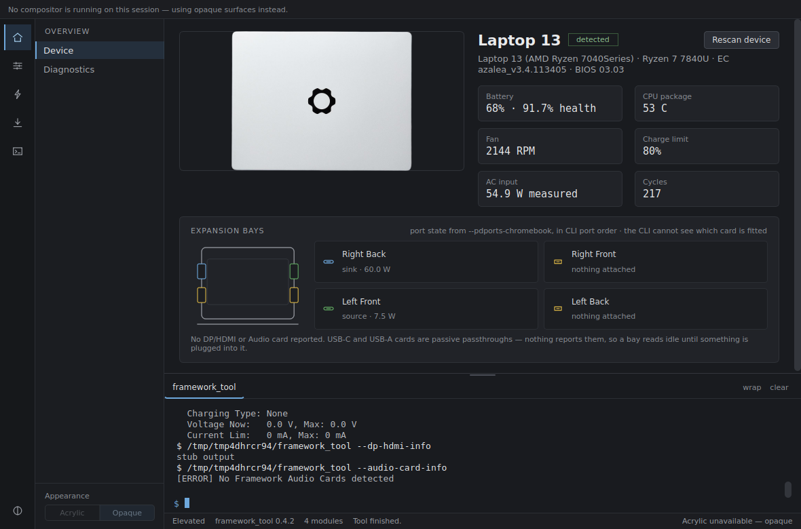
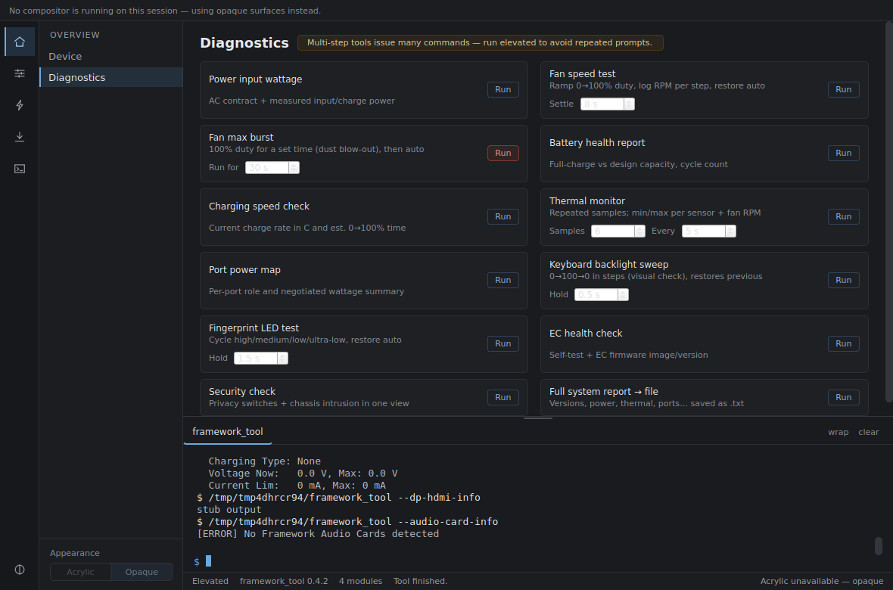
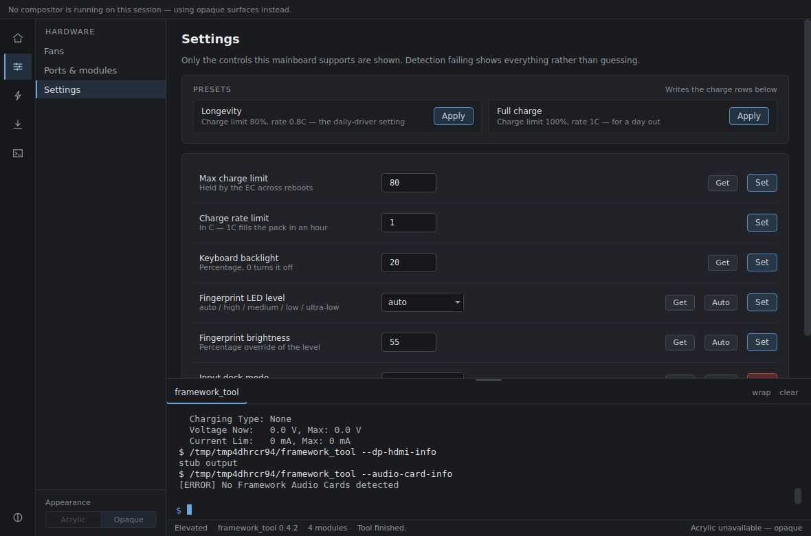
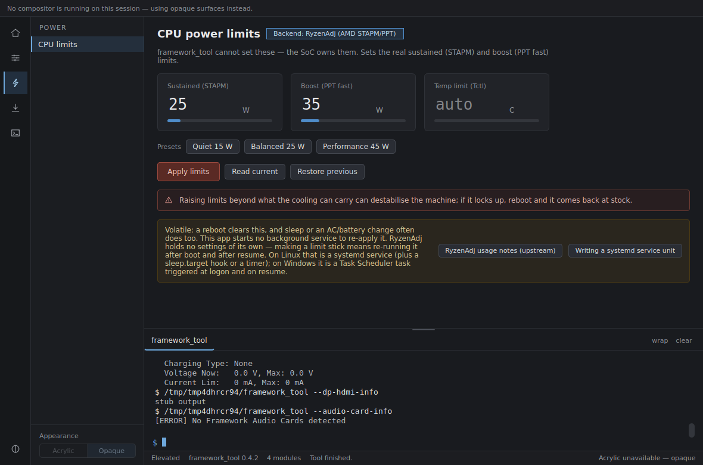

# Using the app

The window is an icon rail (five groups) selecting a pane list, a content
column, and a resizable output drawer. Everything the app runs is echoed
into the drawer with its output underneath, in a tab named for the program
that ran it.

## Overview → Device

The launch scan runs `--versions` once and turns it into a capability set.
Everything else on the pane needs three more elevated commands
(`--power -vv`, `--thermal`, `--pdports`, plus `--charge-limit` and
`--expansion-bay` where they apply), so they run automatically only when you
are already elevated. Otherwise press **Rescan device**.

**Expansion bays.** The bay rows come from the USB-C PD port state, and that
is a statement about the *mainboard port*, not about the card in front of
it. USB-C and USB-A expansion cards are passive passthroughs — there is
nothing on them to enumerate — so a bay with a card in it and nothing
plugged into that card reads "nothing attached". That is the honest answer,
not a failed detection.

A port that reports a role (`sink`, `source`) has something on it; the
wattage is shown when the EC reports enough to work one out, and the voltage
alone when it does not. Some EC firmwares report a charging port's role
without a current limit, which is why the row does not go quiet when the
wattage is missing.

DP/HDMI and Audio cards *are* identifiable — but not locatable, because the
API upstream uses abstracts away the USB topology — so they are listed under
the bays as "also fitted" rather than being dropped into a row that would be
a guess.

The drawing beside the rows is the detected chassis, scaled from its real
dimensions and showing the number of slots that machine has.

## Overview → Diagnostics

Twelve workflows. The ones with a known length draw an animated progress bar
and the timings are yours to change — the fan burst's duration, the thermal
monitor's sample count and interval, the dwell on each backlight and LED
step. Change the number next to Run and the bar reflects the new length.

The multi-step ones can be cancelled at any point, and anything that changed
a state (fan duty, keyboard backlight, fingerprint LED) restores it on the
way out, including on cancel.

**Fan max burst is marked destructive** and names the exact command before
it runs, as does everything else that can leave the machine unhappy.

## Hardware → Fans

Set a duty cycle or a target RPM, read the current speed, and hand control
back to the EC. Automatic control is always one click away.

## Hardware → Ports & modules

The nine per-port queries, each one a single command with its raw output in
the drawer.

## Hardware → Settings

One row per setting the mainboard supports. **Get** reads the current value
back where the CLI has a read for it; a row with no Get is one the CLI can
set but not report, and showing a Get that ran something adjacent would be
worse than showing none.

**Auto** appears on rows whose setting has a real automatic mode. The two
fingerprint rows share one, because `--fp-brightness` has no auto of its own
and `--fp-led-level auto` is what releases both.

**Presets** sit at the top and write the charge rows directly below them.

**Input deck mode** is destructive and says so: the deck carries the keyboard
and trackpad, so switching it off leaves the machine without either.

## Power → CPU limits

`framework_tool` cannot set these — the SoC owns them — so this drives a
different program depending on what you have:

| Backend | CPU | OS | Sets |
| --- | --- | --- | --- |
| RyzenAdj | AMD | both | Real STAPM / PPT limits |
| RAPL (powercap) | Intel, some AMD | Linux | Real long/short power limits |
| powercfg | any | Windows | Maximum processor state — a **frequency** cap, not a wattage |

`powercfg` is in the table precisely because it needs nothing installed. It
is the honest fallback on Intel/Windows, and the app never labels it as
watts.

**These limits are volatile.** A reboot clears them, and often sleep or an
AC/battery change does too. Making one stick needs something to re-apply it
at boot and after resume — a service, a timer, a scheduled task — and this
project does not start background processes. The pane links to the
documentation for setting that up yourself.

## Software → Drivers

Framework keeps one downloads page per device build that is always current,
so this links rather than fetches. It matches the detected board and falls
back to the Knowledge Base index rather than to nothing, and also lists
vendor drivers for parts you swapped in yourself.

## Software → Setup

Detects the helper tools and offers to install them. Nothing installs
without a dialog showing the exact command. Where no package exists the plan
degrades to "here is the page you need" rather than emitting a package
manager command that cannot work.

## Console → Custom command

Free-form arguments against the CLI, and the field to point the app at a
`framework_tool` binary somewhere non-standard. The bricking flags are
refused here too, as is `--console follow`, which never returns.
